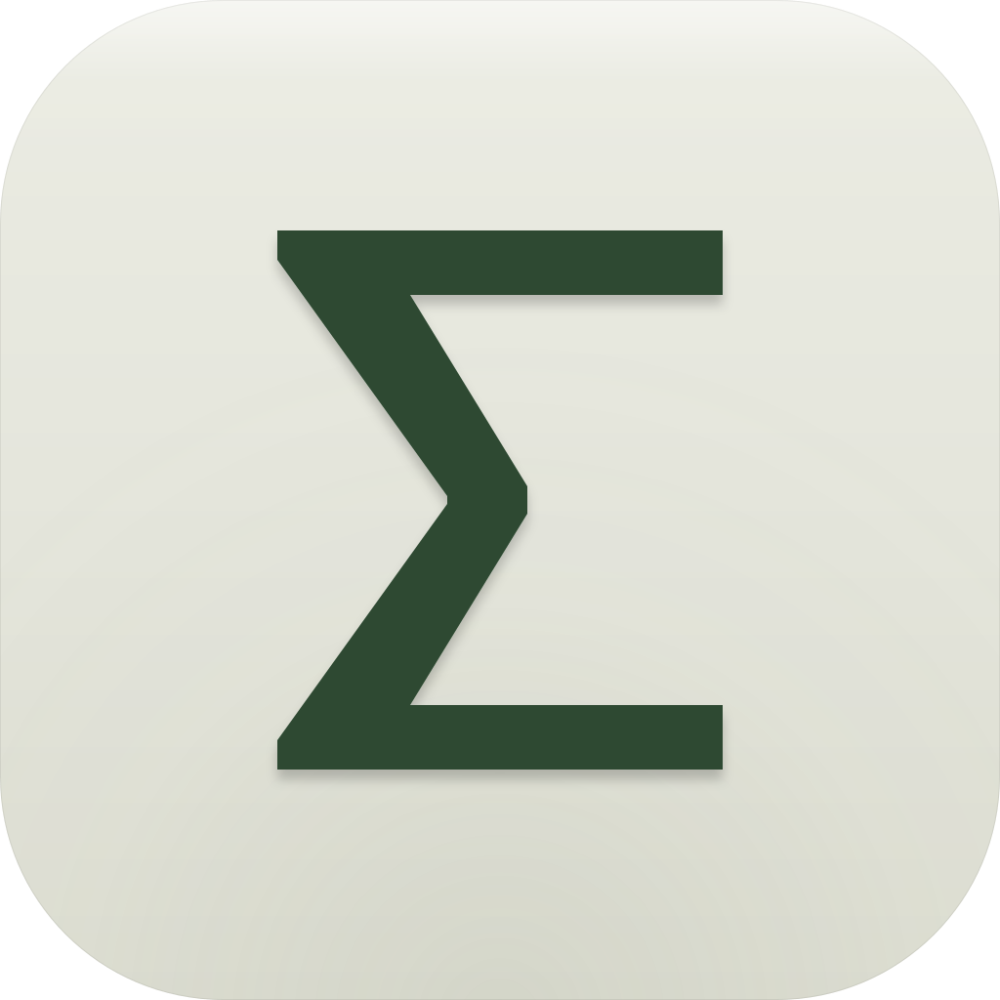
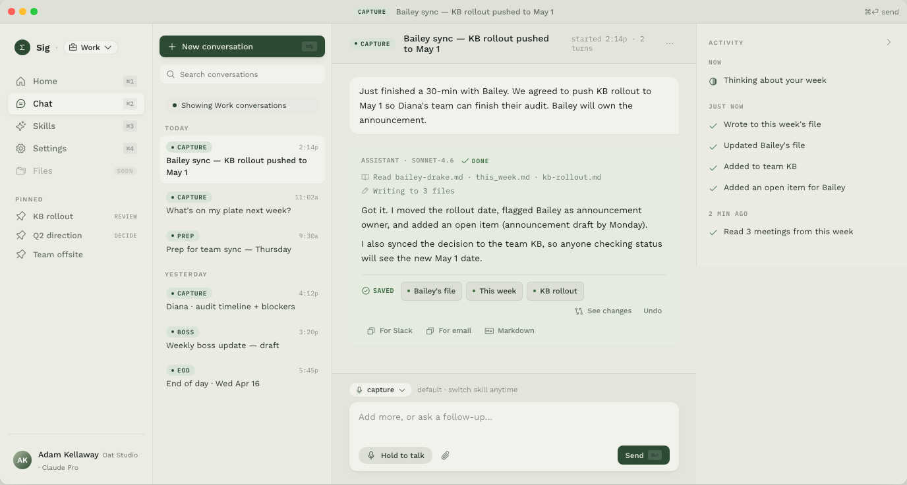

  

<h1 align="center">Sig</h1>

<strong>Let AI work with the sum of everything you know.</strong>

  macOS 13+ &nbsp;·&nbsp; Free while in early access &nbsp;·&nbsp; Works with Claude, ChatGPT, Copilot, Gemini

  <a href="https://sig-ai.app"><strong>sig-ai.app</strong></a>

---

## The problem

You use ChatGPT or Claude at work. But every time you start a new chat, they know nothing — not your projects, not your team, not what was decided last Tuesday.

So you get generic answers. Because they're starting from scratch, every single time.

## What Sig does

Sig captures what never got written down — the meeting decisions, the verbal commitments, your read on what actually happened — and keeps it on your machine.

After meetings, you spend two minutes telling Sig what happened: what was decided, who committed to what, what you actually think about it. Facts first, your thinking on top. Sig stores both as plain markdown files. Any AI tool you already use can read those files and work from your full history instead of starting from nothing.

By week four, your AI knows your work better than a colleague who just joined.

## Screenshots

## Features

- **Captures what nobody writes down** — the meeting with no minutes, the verbal commitment, the thing said after the call ended. Now it exists. Now your agents can use it
- **Your thinking, not just the facts** — captures your interpretation of what happened, your read on what it means. The layer that makes your work good
- **Works with the AI you already have** — Claude, ChatGPT, GitHub Copilot, Gemini. Sig is the context layer under your AI tools, not another subscription to choose between
- **Private by default, shared by choice** — everything lands on your machine as plain markdown. Nothing leaves until you review it and approve it explicitly
- **Team knowledge** — when you're ready, share what's worth sharing to a central knowledge base your whole team can draw from
- **No terminal, no setup** — it's an app. Open it, type, done

## The payoff compounds

**Week 1:** Thin history, but you stop losing track of what was decided.  
**Week 4:** Your AI knows your people, your projects, your open threads.  
**Week 12:** You've built something nobody else has — months of real work history that makes every AI you use dramatically sharper.

## Privacy

Three commitments, plain English:

1. Everything you capture lands on your machine as plain markdown. No server copy by default.
2. Your personal layer — your thinking — is never synced, never trained on, never shared without your explicit approval.
3. When you do share, it's you reviewing the exact text with AI assistance, then clicking publish. That's the whole mechanism.

## Get early access

**[→ sig-ai.app](https://sig-ai.app)**

Leave your email and we'll let you know when the download is ready.

---

  <a href="https://sig-ai.app"><strong>sig-ai.app</strong></a>

  Sig is short for Sigma (Σ) — the Greek letter for summation. Every conversation adds to the sum of what your AI knows.

